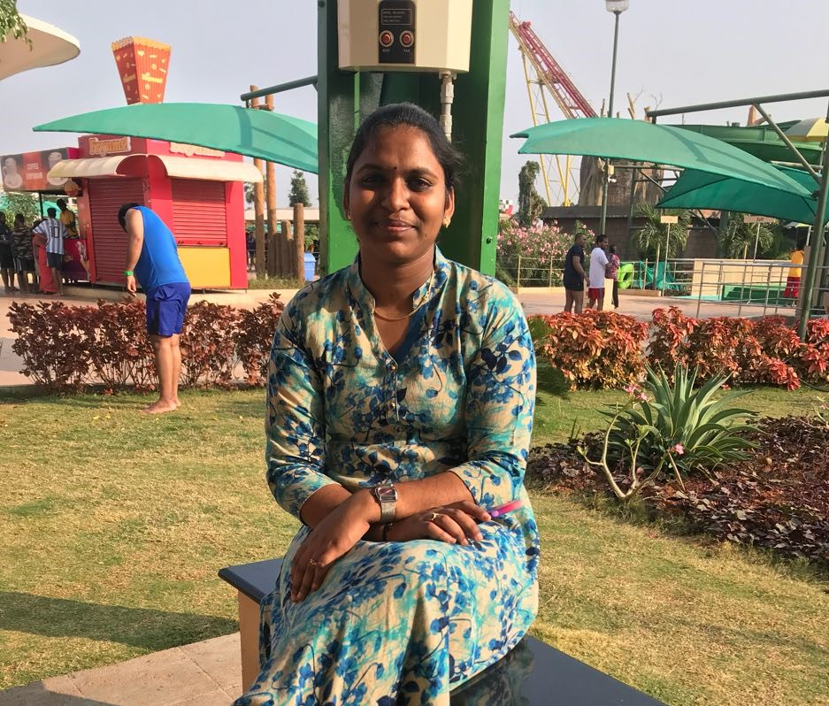

# Anusha Kanagala

During the course of my under graduate study, I was exposed to various courses with applications like electromagnetic fields, control systems, power electronics, electrical machines, electrical measurements linear integrated circuits and subjects involving computer methods like power system control, digital signal processing, microprocessors and microcontrollers, high voltage engineering, utilization of electrical energy, modelling of power system components enhanced my interest in computers. I have gone through labs which included software like MATLAB and SIMULINK which increased my zeal towards computer. I was well versed in programming languages like C and C++ which helped me to get a good score in my engineering.

